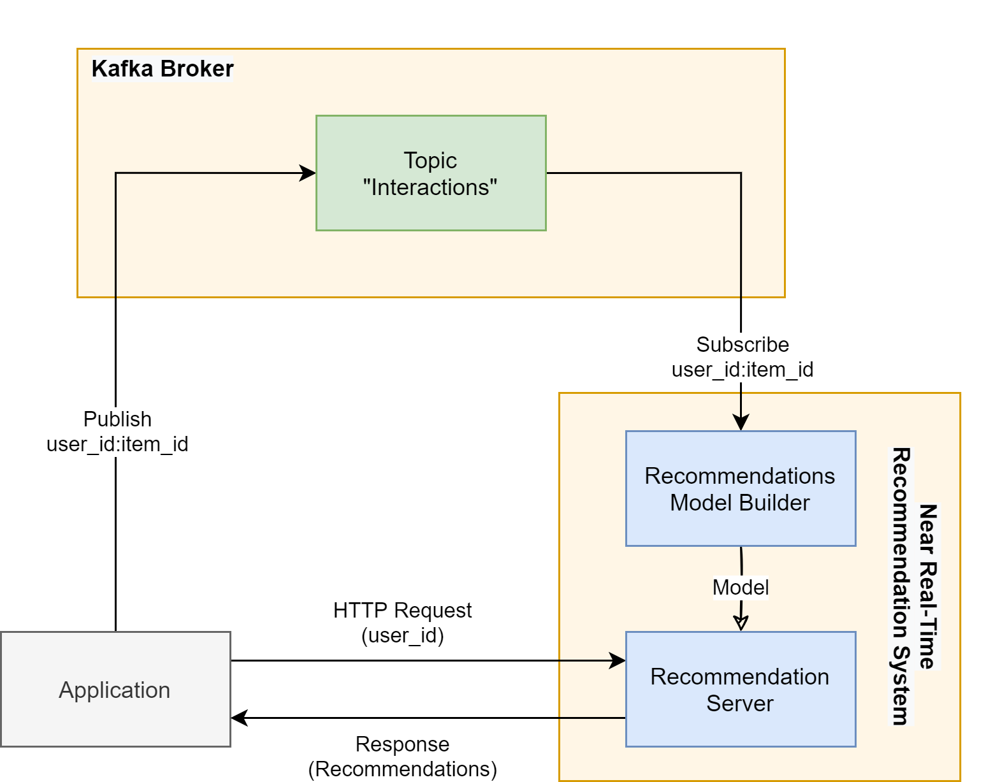

## Real-Time Recommendation Service

"Real-Time Recommendation Service" is a complete solution for applications that aim to provide accurate and up-to-date recommendations to their users, based on changes of their preferences and changes of application's content. This project is part of the thesis "Stream Processing for Near Real-Time Recommendation System".

### How It Works

#### Input Data

As input data the system uses implicit user feedback data from the application using Publish/Subscribe messaging pattern (Apache Kafka). That data represent interactions between users and items and can be defined from each application as desired (e.g. user clicks on an item, reads an article for more than a certain time etc.).

#### Recommendation Generation

For the production of recommendations through implicit feedback, a model-based collaborative filtering technique is used. More specifically, the system collects any new input data published to a specific Kafka topic, creates a sparse user-item matrix and then trains a recommendation model using matrix factorization with Alternating Least Squares (ALS) algorithm ("[Implicit](https://github.com/benfred/implicit)" python implementation), as described in the paper "[Collaborative Filtering for Implicit Feedback Datasets](https://ieeexplore.ieee.org/document/4781121)".

For the purpose of calculating recommendations in real-time based on the latest feedback, the recommendation model is retrained after a defined number of new interactions. Due to the fact that this is a computationally and time intensive procedure, model is retrained using only a specific number of the latest interactions (sliding window technique) and so recommendations are updated in near real-time.

#### Recommendation Service

In order the applications to get recommended items whenever is necessary, the system contains a HTTP Server (developed with Flask web framework) through which receives requests (GET) for recommendations. With a request, applications define the desired target user (user's id) and the number of recommended items that will be returned.

All of the system's functionality, that described previously, is shown in the following architecture diagram.

### License

See the [LICENSE](LICENSE.md) file for license rights and limitations (MIT).
