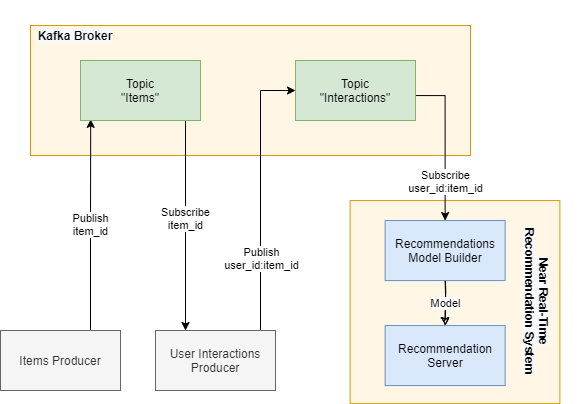

## Real-Time Recommendation Service

"Real-Time Recommendation Service" is a simple and complete solution for applications that aim to provide accurate and up-to-date recommendations to their users, based on changes of their preferences and changes of application's content. This project is part of the thesis "Stream Processing for Near Real-Time Recommendation System".

### How It Works

#### Input Data

As input data the system uses implicit user feedback data from the application using Publish/Subscribe messaging pattern (Apache Kafka). That data represent interactions between users and items and can be defined from each application as desired (e.g. user clicks on an item, reads an article for more than a certain time etc.).

#### Recommendation Generation

For the production of recommendations through implicit feedback, a model-based collaborative filtering technique is used. More specifically, the system collects any new input data published on a specific Kafka topic, creates a sparse user-item matrix and then trains a recommendation model using matrix factorization with Alternating Least Squares (ALS) algorithm ("[Implicit](https://github.com/benfred/implicit)" python implementation), as described in the paper "[Collaborative Filtering for Implicit Feedback Datasets](https://ieeexplore.ieee.org/document/4781121)".

For the purpose of calculating recommendations in real-time based on the latest feedback, the recommendation model is retrained after a defined number of new interactions. Due to the fact that this is a computationally and time intensive procedure, model is retrained using only a specific number of the latest interactions (sliding window technique) and so recommendations are updated in near real-time.

#### Recommendation Service

In order the applications to get recommended items whenever is necessary, the system contains a HTTP Server (developed with Flask web framework) through which receives requests (GET) for recommendations. With a request, applications define the desired target user (user's id) and the number of recommended items that will be returned.

##### System's functionality, that described previously, is shown in the following architecture diagram:


### Deployment Guide

Instructions for setting up recommendation service on a Linux OS with Python 3 installed:

1. **Set up and run Apache Kafka:**
  - Follow Step 1 & Step 2 of Apache Kafka [Quickstart Guide](https://kafka.apache.org/quickstart).
2. **Download project files:** Run ``` git clone https://github.com/p17griv/real-time-recommendation-service.git ``` into a directory in order to download the project.
3. **Create a python virtual environment inside the directory:** (optional) Run ``` python3 -m venv venv ``` to create "venv" virtual environment and ``` source venv/bin/activate ``` to activate it.
4. **Install python dependencies:**
  - Move to "[recommendation-service](recommendation-service)" directory: ``` cd recommendation-service ```.
  - Run ``` pip install -r requirements.txt ```.
5. **Change Kafka address in "kafka_connect.py" file's [line 7](https://github.com/p17griv/real-time-recommendation-service/blob/4973e6118d4cba50bfd688bbf3ca3e909eddfb50/recommendation-service/kafka_connect.py#L7) and [line 17](https://github.com/p17griv/real-time-recommendation-service/blob/4973e6118d4cba50bfd688bbf3ca3e909eddfb50/recommendation-service/kafka_connect.py#L17).**
6. **Modify your application's code in order to publish user-item interactions:**
  - Interactions should have the following form: "userid:itemid".
  - Interactions must be published on a topic that it's called "interactions".
7. **Run "[model builder](recommendation-service/model_builder.py)" program with the apropriate parameters:** ``` python3 modelbuilder.py [interactions_topic] [retrain_frequency] [window_length]```.
  - Run ``` python3 modelbuilder.py -h ``` for more information about the parameters (optional).
8. **Start recommendation server module:** ``` python3 recommender.py ```.
9. **Modify your application's code in order to send GET requests for recommendations (using server's address) with target user's id and desired number of recommended items, as parameters and receive the response (JSON formatted string).**

**Note**
Apache Kafka can be also deployed separately from the recommendation system or in cloud (as well as recommendation system).

### Demo

For demonstration purposes, "Real-Time recommendation Service" is able to run without the existence of a real application, using two secondary programs. The first program ([item_producer.py](demo/item_producer.py)) randomly selects entries (item ids) from ([news_category_dataset_sample.json](demo/news_category_dataset.json)) (original dataset can be found [here](https://www.kaggle.com/rmisra/news-category-dataset?select=News_Category_Dataset_v2.json)) and publishes them on "items" topic. It can do this either once or repeatedly. Then, the second program ([user_interactions_producer.py](demo/user_interactions_producer.py)) creates some random user ids, repeatedly combines them randomly with item ids in "items" topic as interactions and publishes them on "interactions" topic.

##### Demos's functionality, that described previously, is shown in the following architecture diagram:



### Setting Up Demo

1. **Repeat the following instructions included in system's [Deployment Guide]():**
  - Instruction 1: Start Apache Kafka (Step 2. only) (if its not already started).
  - Instruction 3: Activate "venv" virtual environment (if created one previously and not already activated).
  - Instruction 7: Run "[model_builder.py](recommendation-service/model_builder.py)" program.
  - Instruction 8: Run "[recommender.py](recommendation-service/recommender.py)" program.
2. **Move to "[demo](demo)" directory:** ``` cd demo ```.
3. **Run [item_producer.py](demo/item_producer.py) and create some items.**
4. **Run [user_interactions_producer.py](demo/user_interactions_producer.py):**
  - Create some users first.
  - Create interactions.

### Disclaimer

"Real-Time Recommendation Service" created as a concept and no evaluation of its performance or its effectiveness has been done. This might be done in a future project.

### Contributions

Contributions to this project are released to the public under the [project's open source license](LICENSE.md).

Feel free to contribute to "Real-Time Recommendation Service" by submitting pull requests that fixes, expands or improves system's functionalities.

### License

See the [LICENSE](LICENSE.md) file for license rights and limitations (MIT).
